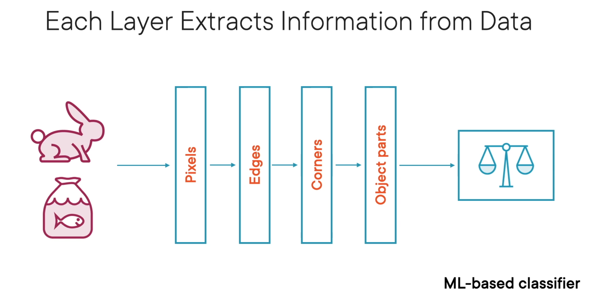
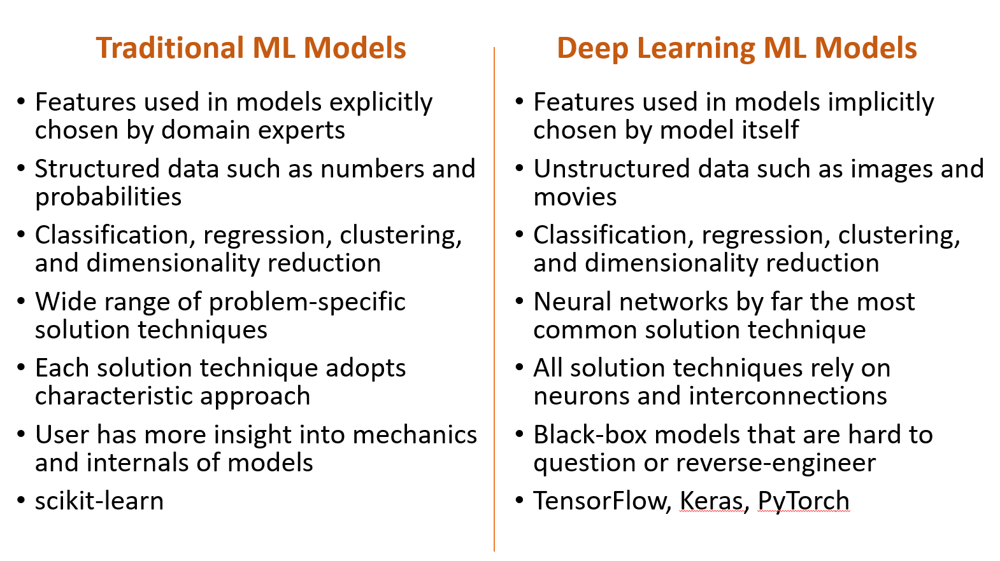

## Traditional ML Models
"Traditional" ML-based systems rely on experts to decide what features to pay attention to - and how
 * Decision Tree: Build a tree structure to classify instance
 * Linear Regression: Fit a line or curve on data to make predictions
 * Draw a hyperplane to classify instances
 * Random Forest, Spectral Clustering, ect.

## Representation ML Models
"Representation" ML Models figure out by themselves which features are important and how they should be used

**Deep Learning** - Algorithms that learn what features matter
* Neural Networks
    * **Neurons:** Building blocks that do the learning
    * Built of layers of individual interconnected neurons
    * Each layer extracts information from the data

## Differences

# Steps for creating a ML Model
1. Set Goal 
    - What are you looking to predict
2. Define hypothesis 
    - "Using these labeled images, can I classify cats vs dogs"
3. Collect Labeled Data 
    - Get 1000s of well labeled images of cats and dogs
4. Test and analyze hypothesis
    - Train the Model
5. Reach Conclusion
    - Model adequately classifies images of cats and dogs
6. Maintain and Retrain over time
    - Repeat steps 3 - 5

Note: Static Learning Models become less useful over time. 
Models degrade in accuracy as soon as they are deployed in the real world. Keep testing and retraining to make sure it's still working. A model needs to be constantly re-trained on new data.

