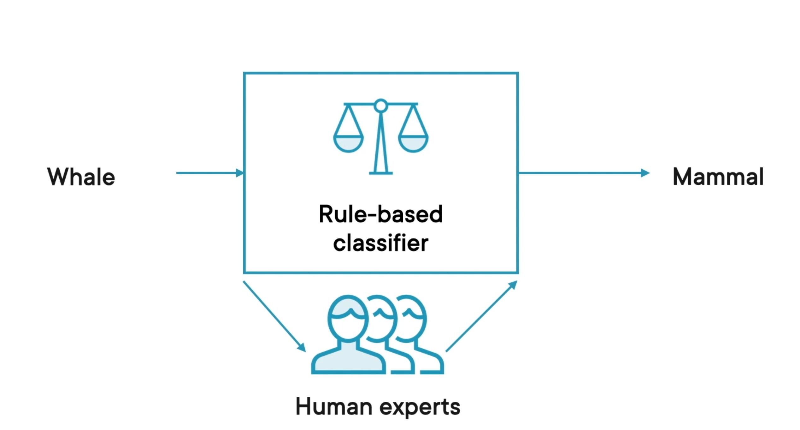
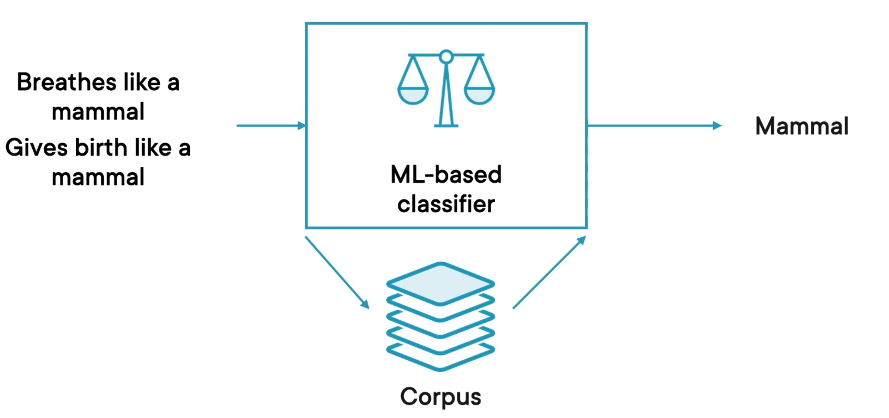
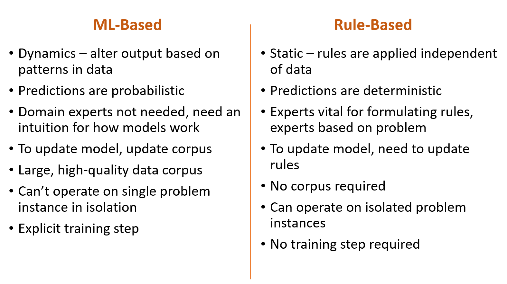

<h1> What is Machine Learning</h1>

Definitions:
 <b>machine learning algorithm:</b> an algorithm that is able to learn from data
 <b>Classification:</b> Identifying which category or categories an observation belongs to
 <b>Binary Classifier:</b> algorithm that places input into 1 of 2 possible categories
 <b>corpus:</b> all data collected for a particular research project, while data set refers to all the data from the corpus that is being used for a particular analysis.
 <b>Feedback - Loss Function:</b> Taking the classified output from a ML algorithm and feeding it back into the algorithm to improve model parameters
 <b>Feature Vector / x variable / feature:</b> Input fed into ML classifier/model
 <b>Label:</b> Output of ML classifier/model
 <b>Rule-Based Learning:</b> generates pre-defined outputs on the basis of previously programmed rules which are hard-coded in the system

ML algorithms differs from normal algorithms in the way that, where normal algorithms are "rule based" where the same input should always produce the same output the output of a machine learning algorithm changes depend on the data used to train the algorithm. Machine learning algorithms search for the patterns in data

<h3>Example - Whales: Fish or Mammals?</h3>

Using a traditional Rule Based Binary Classifier, we have rules defined which tell us how to know if something is a whale. These rules come from experts. The input to our function is the animal  

Using an ML-Based classifier, we feed in characteristics of the animal instead of the animal itself. The ML based classifier then classifies based on the corpus of the data used to train it. 
 
 ML-based Classifier creation can be broken down into two phases: 
<ol>
<li> Training - We provide a large set/corpus of correctly classified data. This trains the Classifier on what is important</li>
<li> Prediction - Check the accuracy by providing new and unseen data to the model produced in the training phase</li>
</ol>

Models are dependent on the data you feed into them. Feed in bad data, you get bad output

<h1>When to use</h1>
<h2>Rule-Based Analysis</h2>
<ol>
<li> Problem statement is fairly simple
<li> Rules are straightforward and can be easily codified
<li> Rules change infrequently
<li> Few Data points available to train ML Models
</ol>

<h2>ML-based Analysis</h2>
<ol>
<li> Problem statement is reasonably complex
<li> Hard to find patterns using visualizations and other exploratory tools
<li> Decision variables are sensitive to data and need to change as new information is received
<li> Lots of data points are available
</ol>

